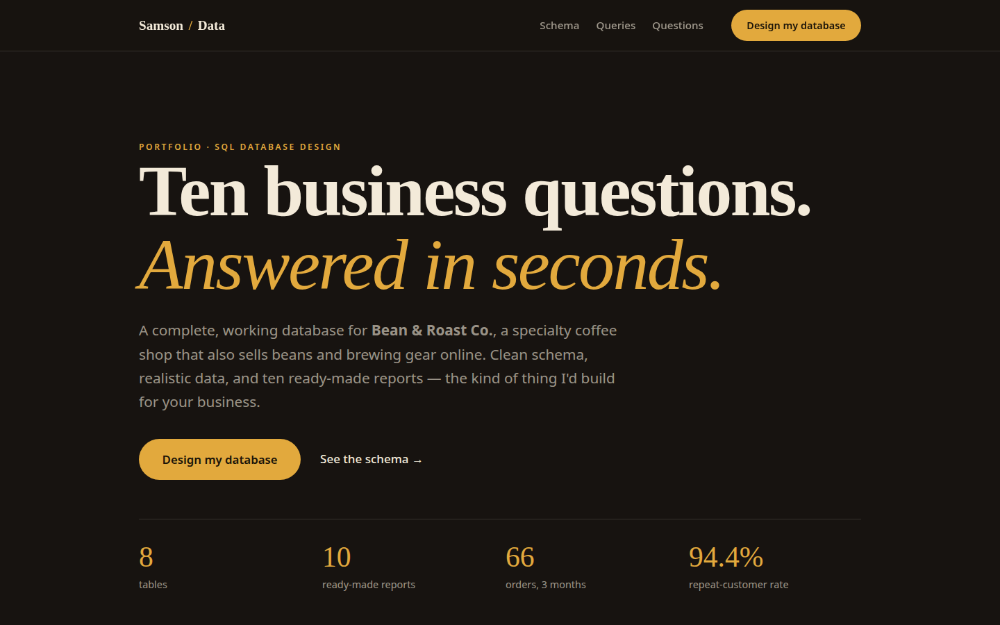

> **Live demo:** [https://coffee-shop-sql.vercel.app](https://coffee-shop-sql.vercel.app)



---

# Bean & Roast Co. — Small-Business Database, Designed & Built

**What if you could answer any question about your business in seconds — without a spreadsheet?**

This is a complete, working database for a specialty coffee shop that also
sells beans and brewing equipment online. I designed the schema, loaded it
with realistic demo data, and wrote 10 ready-made reports a real owner would
run every week.

It's a demo of exactly what I'd build for *your* business: your data,
organized so answers are one question away.

---

## The problem this solves

Most small businesses run on gut feel: *"Which products actually make money?
What's about to run out of stock? Are customers coming back?"* The data to
answer exists — in receipts, inventory sheets, expense folders — but it's
scattered. This project puts it all in one place and answers 10 of the most
common business questions with a single command each.

## The solution

- **A clean relational schema** — 8 tables (`customers`, `products`,
  `categories`, `suppliers`, `orders`, `order_items`, `inventory`,
  `expenses`), with primary and foreign keys, `NOT NULL` and `CHECK`
  constraints, and indexes on the columns reports actually filter on.
- **Realistic seed data** — 14 products, 18 customers, 66 orders over 3
  months, 21 expenses. Enough volume that every report tells a real story.
- **10 ready-made reports** (`queries.sql`) — copy, paste, run. No SQL
  knowledge required.

### The 10 questions it answers

1. Daily revenue, last 30 days — *"Are we trending up or down?"*
2. Top 5 products by revenue — *"What should we never run out of?"*
3. Low-stock alert — *"What needs reordering this week?"*
4. Profit by category — *"Which part of the business actually makes money?"*
5. Repeat-customer rate — *"Are people coming back?"*
6. Slowest-moving products — *"What's gathering dust?"*
7. Monthly revenue vs. expenses — *"What did each month actually earn?"*
8. Best customers by lifetime value — *"Who are our VIPs?"*
9. Busiest hours of the day — *"When do we need extra staff?"*
10. Online vs. in-store revenue split — *"Is the webshop pulling its weight?"*

Sample answers from the demo data: repeat-customer rate of **94.4%**, beans
at **63.5%** gross margin, merchandise at **79.5%**, and peak hours of
**8–9am and 5pm** driving the most in-store orders.

## Tech

- **SQLite** — a full SQL database in a single file. No server to install, no
  hosting cost. Runs on your laptop, a Raspberry Pi, or the cloud.
- **Portable SQL** — `CREATE TABLE`, `JOIN`, `GROUP BY`, CTEs. Everything here
  ports directly to PostgreSQL or MySQL when the business outgrows SQLite.

## How to run

All three steps have been verified end-to-end (SQLite 3.45, Sept 2026).

```bash
cd 09-sql-business-schema
sqlite3 shop.db < schema.sql    # create the tables
sqlite3 shop.db < seed.sql      # load the demo data
sqlite3 shop.db < queries.sql   # run all 10 reports
```

A pre-built `shop.db` is included, so you can skip straight to exploring:

```bash
sqlite3 shop.db < queries.sql
```

Or open `shop.db` in [DB Browser for SQLite](https://sqlitebrowser.org/) to
browse the tables visually. To run a single report, copy one query from
`queries.sql` into `sqlite3 shop.db`.

## Project structure

| File            | What it does                                                              |
|-----------------|---------------------------------------------------------------------------|
| `schema.sql`    | 8 tables with keys, constraints, and indexes                              |
| `seed.sql`      | Realistic demo data: 14 products, 18 customers, 66 orders, 21 expenses    |
| `queries.sql`   | 10 ready-made business reports                                            |
| `showcase.html` | Interactive case-study page (open in a browser)                           |
| `shop.db`       | Pre-built database — optional, explore without running the SQL files      |
